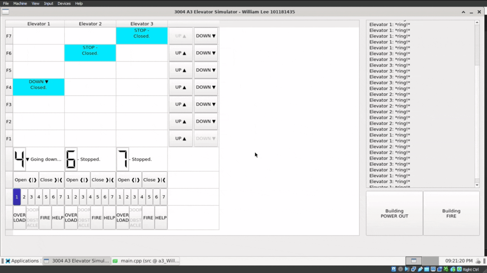
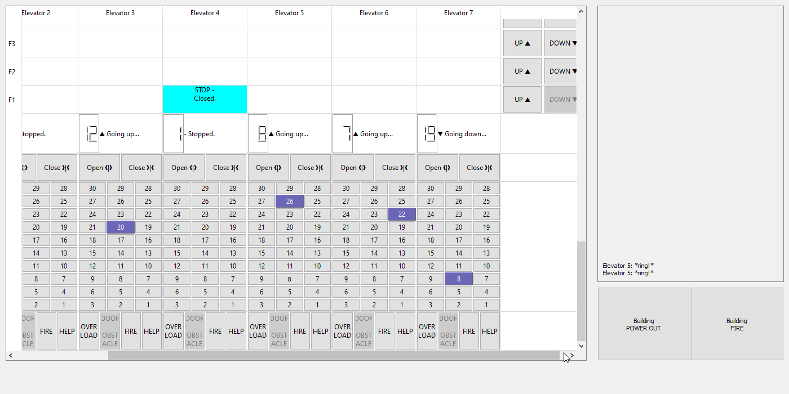

# Qt C++ Elevator System Simulator

Assignment 3 of the COMP3004A course offered in Winter 2024 of Carleton University. Features fully asynchronous, signal/slot based concurrency, and UI that expands to accommodate any number of elevators/floors.

- Sequence, State, and UML Class Diagrams, and Use cases can be found in [`/diagrams`](diagrams/).
- Run the project by opening [a3.pro](a3.pro) in Qt Creator and compiling.

## Gallery

